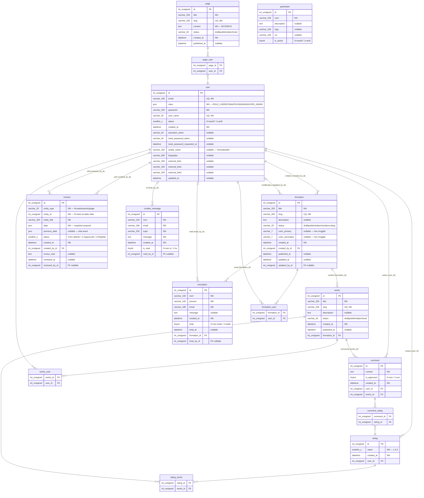

# Schéma UML — Base de données pre2026.cf2m.be

> Généré le 2026-03-19 | Symfony 7.4 / Doctrine ORM / MariaDB 11.4
> Entités : 10 tables + 5 tables de jointure ManyToMany

---

## Diagramme entité-relation (Mermaid ERD)

---

## Résumé des tables

| Table | Lignes de données | Description |
|---|---|---|
| `user` | — | Utilisateurs (étudiants, formateurs, admins) |
| `formation` | — | Formations proposées par le CF2m |
| `works` | — | Activités/projets rattachés à une formation |
| `page` | — | Pages CMS (contenu WYSIWYG) |
| `comment` | — | Commentaires sur les works |
| `rating` | — | Notes (1–5) attribuées à des works ou commentaires |
| `inscription` | — | Demandes d'inscription publiques |
| `revision` | — | Historique de révisions (workflow de validation) |
| `partenaire` | — | Partenaires du CF2m |
| `contact_message` | — | Messages du formulaire de contact |

### Tables de jointure ManyToMany

| Table jointure | Relation |
|---|---|
| `formation_user` | Formation ↔ User (responsables/formateurs) |
| `works_user` | Works ↔ User (co-auteurs) |
| `page_user` | Page ↔ User (co-auteurs) |
| `comment_rating` | Comment ↔ Rating |
| `rating_works` | Rating ↔ Works |

### Particularité : Révisions polymorphiques

La table `revision` utilise une relation polymorphique applicative :
- `entity_type` (varchar 20) indique la table cible : `"formation"`, `"works"` ou `"page"`
- `entity_id` pointe vers l'id dans cette table
- Pas de contrainte FK déclarée en base — gérée par `RevisionService`

Workflow : **En attente (0)** → **Approuvée (1)** ou **Rejetée (2)**
