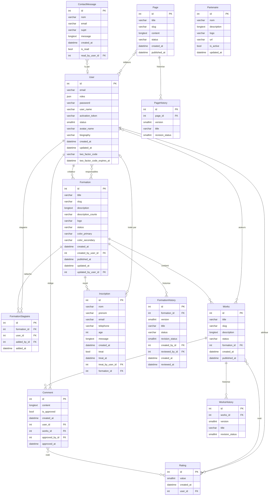

# Schéma de base de données — CF2m

## Moteur
MariaDB 11.4 — encodage `utf8mb4` — collation `utf8mb4_unicode_ci`

## Entités principales

### User
| Champ                       | Type              | Notes                                                           |
|-----------------------------|-------------------|-----------------------------------------------------------------|
| id                          | int unsigned (PK) | Auto-increment, assigné par Doctrine                            |
| email                       | varchar(180)      | Unique                                                          |
| roles                       | json              | Ex: ["ROLE_ADMIN"] — ROLE_USER toujours ajouté                  |
| password                    | varchar(255)      | Hashé (bcrypt) — non mappé : `plainPassword`                    |
| user_name                   | varchar(50)       | Unique, alphanumérique + underscore                             |
| activation_token            | varchar(64)       | Nullable — confirmation email                                   |
| status                      | smallint unsigned | 0 = inactif, 1 = actif, 2 = banni (défaut : 0)                  |
| reset_password_token        | varchar(64)       | Nullable                                                        |
| reset_password_requested_at | datetime          | Nullable                                                        |
| avatar_name                 | varchar(255)      | Nullable — nom du fichier (VichUploader, mapping `user_avatar`) |
| biography                   | varchar(600)      | Nullable                                                        |
| external_link1              | varchar(255)      | Nullable — URL validée                                          |
| external_link2              | varchar(255)      | Nullable — URL validée                                          |
| external_link3              | varchar(255)      | Nullable — URL validée                                          |
| created_at                  | datetime          | Défini via `#[ORM\PrePersist]`                                  |
| updated_at                  | datetime          | Nullable — mis à jour via `setAvatarFile()` (VichUploader)      |
| two_factor_code             | varchar(6)        | Nullable — code 2FA temporaire (6 chiffres)                     |
| two_factor_code_expires_at  | datetime          | Nullable — expiration du code (TTL 15 min)                      |

**Champ non mappé** : `avatarFile` (`File`) — géré par VichUploader, ne persiste pas en BDD.

**Helpers de rôles** : `addRole()` / `removeRole()` manipulent directement le tableau `$roles` (utilisés par `StagiaireService` pour synchroniser `ROLE_STAGIAIRE`, voir plus bas). `getRoles()` / `setRoles()` restent inchangés.

### Formation
> Une formation peut avoir plusieurs utilisateurs responsables (ManyToMany), plusieurs travaux associés (OneToMany), et plusieurs stagiaires rattachés via l'entité pivot `FormationStagiaire`.

| Champ               | Type                     | Notes                                              |
|---------------------|--------------------------|-----------------------------------------------------|
| id                  | int unsigned (PK)        |                                                     |
| title               | varchar(255)             |                                                     |
| slug                | varchar(255)             | Unique                                             |
| description         | longtext                 | Nullable — contenu riche (SunEditor)               |
| description_courte  | varchar(800)             | Nullable — utilisée pour les meta descriptions SEO |
| logo                | varchar(255)              | Nullable — nom de fichier (VichUploader, mapping `formation_logo`) |
| status              | varchar(20)              | draft / published / archived / recruiting          |
| color_primary       | varchar(7)                | Nullable — couleur hex `#rrggbb`                   |
| color_secondary     | varchar(7)                | Nullable — couleur hex `#rrggbb`                   |
| created_at          | datetime                 | Via `#[ORM\PrePersist]`                            |
| created_by_user_id  | int unsigned (FK → User) | Créateur (ManyToOne, obligatoire)                  |
| published_at        | datetime                 | Nullable                                           |
| updated_at          | datetime                 | Nullable                                           |
| updated_by_user_id  | int unsigned (FK → User) | Nullable (si jamais mis à jour)                    |

**Champ non mappé** : `logoFile` (`File`) — géré par VichUploader.

**Relations** :
- `formation_user` (ManyToMany entre Formation et User — responsables)
- `FormationStagiaire` (OneToMany, `orphanRemoval: true`) — stagiaires rattachés

### FormationStagiaire (entité pivot)
> Rattache un `User` à une `Formation` précise. La présence d'au moins une ligne pour un utilisateur déclenche la synchronisation physique de `ROLE_STAGIAIRE` sur `User.roles` (voir `StagiaireService`). Voir `docs/architecture/proposition-gestion-stagiaires-formation.md` pour le contexte de conception.

| Champ         | Type                      | Notes                                          |
|---------------|---------------------------|-------------------------------------------------|
| id            | int unsigned (PK)         |                                                 |
| formation_id  | int unsigned (FK → Formation) | ManyToOne, `NOT NULL`, `ON DELETE CASCADE`  |
| user_id       | int unsigned (FK → User)  | ManyToOne, `NOT NULL`, `ON DELETE CASCADE`      |
| added_by_id   | int unsigned (FK → User)  | Nullable, `ON DELETE SET NULL` — gestionnaire ayant fait le rattachement |
| added_at      | datetime                  | Via `#[ORM\PrePersist]`                        |

**Contrainte** : `UNIQUE (formation_id, user_id)` — un stagiaire ne peut être rattaché deux fois à la même formation.

### Works (travaux de stagiaires)
| Champ | Type | Notes |
|-------|------|-------|
| id | int unsigned (PK) | |
| title | varchar(255) | |
| slug | varchar(255) | Unique |
| description | longtext | Nullable |
| status | varchar(20) | draft / published / archived |
| formation_id | int unsigned (FK → Formation) | ManyToOne |
| created_at | datetime | |
| published_at | datetime | Nullable |

**Relations** :
- `works_user` (ManyToMany entre Works et User — stagiaires auteurs)
- `rating_works` (ManyToMany entre Works et Rating)

### Comment
| Champ | Type | Notes |
|-------|------|-------|
| id | int unsigned (PK) | |
| content | longtext | |
| is_approved | tinyint unsigned | Modération obligatoire (0/1, défaut `false`) |
| created_at | datetime | |
| user_id | int unsigned (FK → User) | Auteur |
| works_id | int unsigned (FK → Works) | |
| approved_by_id | int unsigned (FK → User) | Nullable — admin/formateur ayant approuvé |
| approved_at | datetime | Nullable |

**Relation** : `comment_rating` (ManyToMany entre Comment et Rating)

### Rating
> Notes attribuées sur **Works** et **Comment** (ManyToMany), 1 à 5 étoiles.

| Champ | Type | Notes |
|-------|------|-------|
| id | int unsigned (PK) | |
| value | smallint unsigned | Note attribuée, 1 à 5 (`Assert\Range`) |
| created_at | datetime | Via `#[ORM\PrePersist]` |
| user_id | int unsigned (FK → User) | ManyToOne — auteur de la note |

**Tables de jointure** :
- `comment_rating` (ManyToMany entre Rating et Comment)
- `rating_works` (ManyToMany entre Rating et Works)

### Inscription
| Champ             | Type                          | Notes                                 |
|-------------------|-------------------------------|----------------------------------------|
| id                | int unsigned (PK)             |                                       |
| nom               | varchar(100)                  |                                       |
| prenom            | varchar(100)                  |                                       |
| email             | varchar(180)                  |                                       |
| telephone         | varchar(30)                   |                                       |
| age               | int unsigned                  |                                       |
| message           | longtext                      | Nullable                              |
| created_at        | datetime                      | Via `#[ORM\PrePersist]`               |
| treat             | tinyint unsigned              | false (défaut) / true                 |
| treat_at          | datetime                      | Nullable                              |
| treat_by_user_id  | int unsigned (FK → User)      | Nullable (si inscription non traitée) |
| formation_id      | int unsigned (FK → Formation) | ManyToOne                             |

### ContactMessage
> mail + DB

| Champ           | Type | Notes                                     |
|-----------------|------|--------------------------------------------|
| id              | int unsigned (PK) |                                       |
| nom             | varchar(100) |                                             |
| email           | varchar(180) |                                             |
| sujet           | varchar(255) |                                             |
| message         | longtext |                                                 |
| created_at      | datetime |                                                 |
| is_read         | tinyint unsigned | false (défaut) / true                     |
| read_by_user_id | int unsigned (FK → User) | Nullable (si message n'est pas encore lu) |

### Page
| Champ | Type | Notes |
|-------|------|-------|
| id | int unsigned (PK) | |
| title | varchar(255) | |
| slug | varchar(255) | Unique |
| content | longtext | |
| status | varchar(20) | draft / published / archived |
| created_at | datetime | |
| published_at | datetime | Nullable |

**Relation** : `page_user` (ManyToMany entre Page et User — éditeurs)

### Partenaire
| Champ | Type | Notes |
|-------|------|-------|
| id | int unsigned (PK) | |
| nom | varchar(255) | |
| description | longtext | Nullable |
| logo | varchar(255) | Nullable — nom de fichier (VichUploader, mapping `partenaire_logo`) |
| url | varchar(255) | Nullable |
| is_active | tinyint unsigned | false (défaut) / true |
| updated_at | datetime | Nullable — mis à jour via `setLogoFile()` (VichUploader) |

**Champ non mappé** : `logoFile` (`File`) — redimensionné automatiquement par `PartenaireLogoResizeSubscriber`.

---

## Tables d'historique (révisions)

> Voir `docs/architecture/decision-historique-revisions.md` pour la décision d'architecture complète. Une table d'historique typée par type de contenu (`Formation`, `Page`, `Works`), chacune avec sa propre table de jointure ManyToMany pour les responsables/éditeurs figés au moment du snapshot. Trait commun `RevisionWorkflowTrait` (`src/Entity/Trait/`) portant `revisionStatus`, `createdBy`, `createdAt`, `reviewedBy`, `reviewedAt`.

### Statuts `revision_status` (commun aux 3 tables)
| Valeur | Constante | Signification |
|---|---|---|
| 0 | `STATUS_PENDING` | En attente de validation admin |
| 1 | `STATUS_APPROVED` | Approuvé après relecture |
| 2 | `STATUS_REJECTED` | Rejeté par un admin |
| 3 | `STATUS_AUTO_APPROVED` | Auto-approuvé (admin direct ou restauration) |

### formation_history
| Champ | Type | Notes |
|-------|------|-------|
| id | int unsigned (PK) | |
| formation_id | int unsigned (FK → Formation) | `ON DELETE CASCADE` |
| version | smallint unsigned | |
| title, slug, description, description_courte, logo, status, color_primary, color_secondary, published_at | — | Snapshot des champs `Formation` au moment de la révision |
| revision_status | smallint unsigned | Voir statuts ci-dessus |
| created_by_id / reviewed_by_id | int unsigned (FK → User) | |
| created_at / reviewed_at | datetime | |

**Contrainte** : `UNIQUE (formation_id, version)`. **Table de jointure** : `formation_history_responsable` (responsables au moment du snapshot).

### page_history
Mêmes principes, snapshot des champs `Page` (`title`, `slug`, `content`, `status`, `published_at`). **Table de jointure** : `page_history_user` (éditeurs au moment du snapshot).

### works_history
Mêmes principes, snapshot des champs `Works` (`title`, `slug`, `description`, `status`, `formation_id`, `published_at`). **Table de jointure** : `works_history_user` (stagiaires auteurs au moment du snapshot).

> **Note** : l'entité `Revision` (table polymorphique JSON) et la commande `MigrateRevisionsCommand` subsistent dans le code pour la migration historique ponctuelle (tâche 085) mais la table `revision` a été supprimée (tâche 088) — voir `decision-historique-revisions.md`.

---

## Relations résumées
```
User ──< Formation                    (ManyToOne — créateur via created_by_user_id)
Formation >──< User                   (ManyToMany via formation_user — responsables)
Formation ──< Works                   (ManyToOne)
Formation ──< FormationStagiaire      (ManyToOne, cascade delete)
User ──< FormationStagiaire           (ManyToOne, cascade delete — stagiaire)
User ──< FormationStagiaire           (ManyToOne nullable, set null — addedBy)
Works >──< User                       (ManyToMany via works_user)
Works ──< Comment                     (ManyToOne)
User ──< Comment                      (ManyToOne — auteur)
User ──< Comment                      (ManyToOne nullable — approvedBy)
Comment >──< Rating                   (ManyToMany via comment_rating)
Works >──< Rating                     (ManyToMany via rating_works)
User ──< Rating                       (ManyToOne — auteur de la note)
Formation ──< Inscription             (ManyToOne)
Inscription ──> User                  (ManyToOne nullable — traité par un admin)
ContactMessage ──> User               (ManyToOne nullable — lu par un admin)
Page >──< User                        (ManyToMany via page_user)
Formation ──< FormationHistory        (ManyToOne, cascade delete)
FormationHistory >──< User            (ManyToMany via formation_history_responsable)
Page ──< PageHistory                  (ManyToOne, cascade delete)
PageHistory >──< User                 (ManyToMany via page_history_user)
Works ──< WorksHistory                (ManyToOne, cascade delete)
WorksHistory >──< User                (ManyToMany via works_history_user)
```

## Conventions
- Nommage BDD : `snake_case`
- Clés étrangères : suffixe `_id`
- Tables de jointure ManyToMany : `entite1_entite2` (ordre alphabétique), sauf tables d'historique (`xxx_history_user` / `xxx_history_responsable`)
- `id` toujours `unsigned`
- Statuts gérés comme `smallint unsigned` (booléens simulés : `is_approved`, `treat`, `is_read`, `is_active`) ou `string` enum-like selon l'entité (`status` sur Formation/Works/Page)
- Timestamps : `createdAt` via `#[ORM\PrePersist]`, `updatedAt` mis à jour via VichUploader (`setAvatarFile()`/`setLogoFile()`) ou manuellement
- Champs fichier VichUploader : non mappés en BDD (`avatarFile`, `logoFile`), seul le nom est persisté (`avatarName`, `logo`)

## Graphique de l'architecture de la BDD

